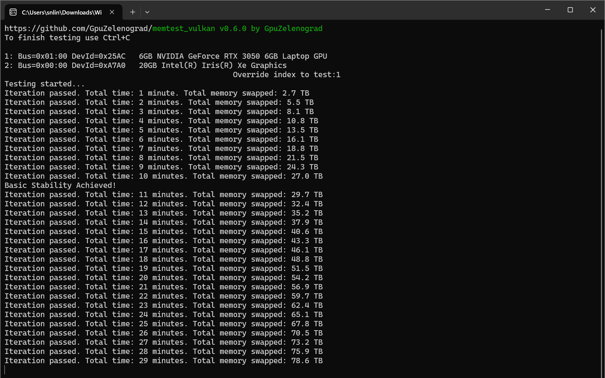

# Memtest Vulkan - GPU Oveclocking Stability Tool

Opensource cross-platform tool written in vulkan compute to stress test video memory for stability during overclocking or repair.

Requires system-provided vulkan loader and driver supporting Vulkan 1.1 (already installed with graphics drivers on most OS).

## Installation & Usage (Windows)

###  Get .exe from latest release
GitHub users also may want to try CI build artifacts.

Start test by double-clicking the utility, no installation / parameters / configuration / admin-rights required.

This is sample output after running for 29 minutes with no errors.

Any found errors are immediately reported with a multi-line details. Detailed descriptions given below may help in advanced cases, but most of the time it's enough just check if errors are absent or present.

### Installation & Usage (Linux)

Install by unpacking archives with linux prebuilt binaries for X86_64 (Desktop) or AARCH64 (Embedded).

Use by opening a terminal in a folder with extracted file and explicitly running `./memtest_vulkan`. Do NOT just double-click binary in GUI (it would lead to starting test in the background without ability to stop it)

Linux platform often contains additional `llvmpipe` pure-CPU vulkan driver. So after the start device selection menu will be shown. You can wait 10 seconds for automatic device selection or manually type the device number to test

With multiple drivers packages installed running under linux may require explicitly setting environment variables

# Understanding Output & Stopping Testing
This is a much simplified version of the original output we only care about if the test iteration passed without errors and the total amount of memory written which is only added for metrics.

Use `CTRL+C` to stop the tests.

# <a id="troubleshooting">Troubleshooting & Reporting Bugs</a>
This section is taken as is from the original contributor Vasily.

Here is the list of common errors that prevent test from starting
* `memtest_vulkan: early exit during init: The library failed to load` 
This message means that your system lacks the Khronos Group Vulkan-Loader library. This library is used as a multiplexer between different drivers provided for different devices and typically is installed during installation of any device-specific vulkan driver. However, some platforms may need explicit installation: for example, to install it on ubuntu 18.04 run `sudo apt install libvulkan1`.
Note that this library itself doesn't depend on any GPU, it is loadable even without any vulkan-capable devices at all. So the error above is a pure software-related error, not related to hardware at all. For windows7 x64 you may need [downloading `vulkan-1.dll` manually](https://github.com/GpuZelenograd/memtest_vulkan/releases/tag/support).
* `memtest_vulkan: early exit during init: ERROR_INCOMPATIBLE_DRIVER` 
`memtest_vulkan: early exit during init: ERROR_INITIALIZATION_FAILED` 
Those messages mean that your system lacks the vulkan driver for your GPU or your system doesn't have any vulkan-capable devices. If the device is known to be vulkan-capable try removing all GPU drivers and reinstalling/updating a driver for the device you want to test.
* `Runtime error: This device lacks support for DEVICE_LOCAL+HOST_COHERENT memory type.` 
Typical causes are software or hardware not supported by memtets_vulkan:
  * Emulator/translator usage: if the tested GPU name in the output mentions something like `Microsoft Direct3D12 (model name)` — the translator similar to Mesa Dozen “Vulkan-over-Direct3D12” is used, maybe installed as “OpenCL, OpenGL and Vulkan Compatibility Pack”. If several devices are listed on the memtest_vulkan startup, try selecting another driver variant.
  * Pre-2016 GPU: Some older GPUs are not supported due to driver limitations, like GTX780Ti on Windows even with the latest 472.xx driver
  * Old OS/driver: Windows 7 with 47x.xx driver has driver limitations even with post-2016 GPUs that are supported in newer environments.
* `Runtime error: Failed determining memory budget` on the integrated GPU  
If the integrated GPU is configured with fixed & quite low dedicated memory size - it may be shown in memtest_vulkan output only with 1GB VRAM: `1GB AMD Radeon(TM) Vega 3 Graphics` and then fail. The vulkan implementation for integrated GPUs allows using a bit less memory than reserved, and memtest_vulkan requires at least 1GB available memory to operate. Reconfigure integrated GPU to reserve at least 1.5GB of memory, see [issue #22](https://github.com/GpuZelenograd/memtest_vulkan/issues/22)
* `INIT OR FIRST testing failed due to runtime error`  
If the test fails to start and shows this message for a newer GPU - there is some incompatibility in vulkan installation. This may be caused by outdated driver or conflicts between several vulkan drivers installed.    
For example on Linux the test can be run with a specific ICD the following way: 
`VK_DRIVER_FILES=/usr/share/vulkan/icd.d/nvidia_icd.json ./memtest_vulkan` 
[With Khronos vulkan loader `libvulkan.so` version below v1.3.207 use `VK_ICD_FILENAMES` instead of `VK_DRIVER_FILES`](https://github.com/KhronosGroup/Vulkan-Loader/blob/v1.3.233/docs/LoaderInterfaceArchitecture.md#table-of-debug-environment-variables) 
Also try running with root/admin privileges - this is sometimes required on headless devices.

There are some reports that testing AMD GPUs sometimes gives unexpectedly low GPU load & video memory usage. The issue is still under investigation, but it is known that disabling/enabling "resizable BAR" in BIOS may help.

Also, some drivers don't allow contiguous allocation of memory regions more than 4GB even on a GPU with a lot of memory. Such GPUs are tested with a 3.5GB memory allocation. This is not perfect, but such testing allows still allows detecting most of the errors, so don't bother if this is your case.

If nothing helps - enable verbose mode by renaming the executable to `memtest_vulkan_verbose` and running again. The test will output diagnostic information to stdout - please copy it to a new issue at https://github.com/GpuZelenograd/memtest_vulkan/issues.

# Acknowledgements
Thank you very much to GitHub user: galkinvv (Vasily Galkin) for the core logic of the tool. The truth is I only adapted output, iterations and metrics so far so most of the work is still your achievement and I suggest everyone to thank Vasily and see his other great work. This by no mean aims to take over the main repo as a continuation its as I keep saying an adjustement to it for finding overclocking stability.

Below I will keep the acknowledgements that Vasily already had:

The idea was inspired by OpenCL-based cross-platform memory testing tool [memtestCL](https://github.com/ihaque/memtestCL).

The implementation would not be possible without great vulkan bindings for rust provided by zlib-licensed [erupt library](https://gitlab.com/Friz64/erupt).
So, for licensing simplicity, memtest_vulkan is also licensed under the [zlib License](https://github.com/GpuZelenograd/memtest_vulkan/blob/main/LICENSE).

The `memtest_vulkan` itself was developed by [GpuZelenograd repair center](https://gpuzelenograd.github.io/README?memtest_vulkan)
